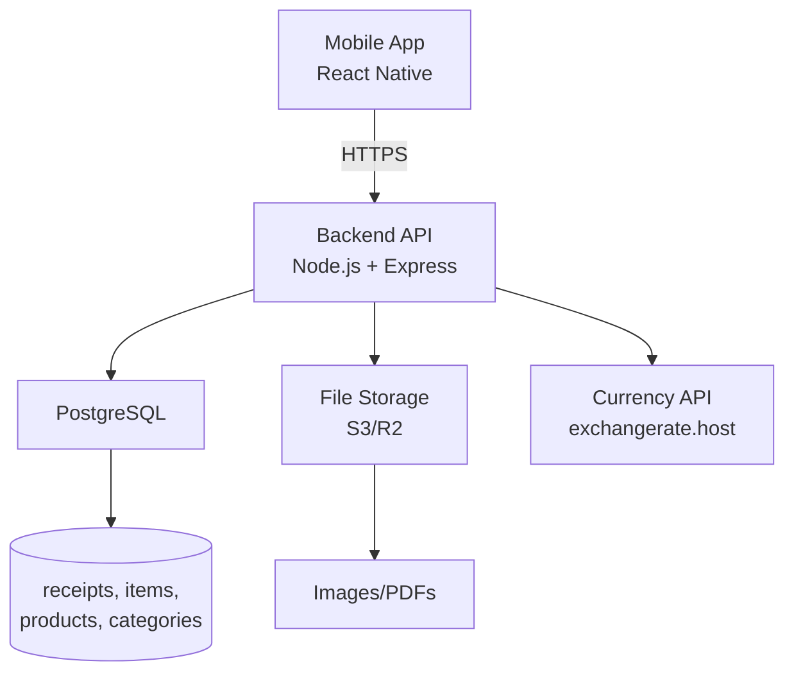

# 01 – System Architecture

## Overview

The Receipt Intelligence App follows a **cloud‑first** architecture. The mobile client communicates with a backend API that handles all data persistence, file storage, and business logic. No local database is used in V1.

## High‑Level Diagram

## Component Details
Mobile App
State management: Zustand (or Redux Toolkit) for global app state.

API client: Axios configured with base URL and API key.

Navigation: React Navigation (bottom tabs + stack).

File handling: expo-image-picker for images, expo-document-picker for PDFs. Upload via multipart/form‑data.

Charts: Victory Native for smooth, animated charts.

Backend API
Framework: Node.js + Express.

Authentication: API key (sent in X-API-Key header) for V1. Each user has a unique key.

Validation: Use Joi or Zod for request validation.

Currency conversion: Fetch rates from exchangerate.host; cache results for 1 hour.

File upload: Use multer to handle multipart; store file in cloud storage (e.g., Supabase Storage, AWS S3).

Export: Generate CSV, JSON, XML, Excel on the fly and serve as downloadable file.

Database
Type: PostgreSQL (or any SQL database).

Migrations: Use Knex or Prisma to manage schema changes.

Indexes: Optimize for common queries (date ranges, full‑text search, foreign keys).

File Storage
Service: Supabase Storage, Cloudflare R2, or AWS S3.

Naming: UUID‑based filenames to avoid collisions.

Public URLs: Generate signed URLs or use public bucket (if security allows). For V1, public URLs are acceptable because data is private to the user.

Currency API
Provider: exchangerate.host – free, no API key required for basic usage.

Usage: For each receipt, call https://api.exchangerate.host/convert?from={original_currency}&to={primary_currency}&date={date}. If no date (real‑time), omit date to get latest.

Data Flow
Add Receipt:

User fills form, selects file.

App uploads file to backend (multipart).

Backend stores file, receives URL.

Backend fetches exchange rate, computes totals.

Backend inserts receipt and items into database.

Response returns receipt ID.

List Receipts:

App sends search/filter/sort parameters.

Backend builds SQL query with pagination.

Returns paginated results.

Analytics:

App requests aggregated data (e.g., top categories).

Backend executes SQL aggregations.

Returns JSON.

Export:

App requests export with date range and format.

Backend queries all matching receipts+items, formats file, streams response.

Import:

App sends file (multipart) to /import.

Backend parses, validates, inserts in a transaction (rollback on error).

Security
API Key: Stored in mobile app (Expo SecureStore). Sent in every request.

CORS: Restrict to mobile app domain.

File upload validation: Check file type and size; scan for malware (optional).

No user accounts: Single user per backend instance.

Extensibility
The architecture is modular: replace any component (e.g., file storage, currency API) without affecting others.

Future V2 may add local SQLite for offline support; repositories abstract the data source.
