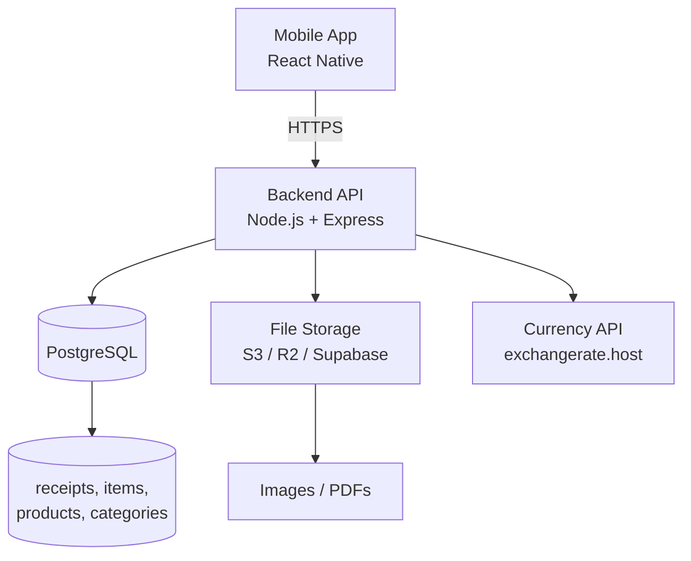

# 01 – System Architecture (Refined)

## Overview

The Receipt Intelligence App follows a **cloud‑first** architecture. All data is stored remotely, and the mobile client communicates with a backend API that handles persistence, file storage, and business logic. No local database is used in V1.

## High‑Level Diagram

## Component Details

### Mobile App

| Area | Technology / Approach |
|------|----------------------|
| Framework | Any (React Native, Flutter, etc.) |
| State Management | Any (Zustand, Redux Toolkit, etc.) |
| Navigation | Any (React Navigation, native navigation) |
| API Client | Any (Axios, fetch) |
| File Handling | Camera/gallery pickers, document pickers; upload via multipart/form-data |
| Charts | Any charting library (Victory Native, react-native-chart-kit, etc.) |
| Secure Storage | Any secure storage (Expo SecureStore, react-native-keychain) |

### Backend API

| Area | Technology / Approach |
|------|----------------------|
| Runtime | Any (Node.js, Next.js, Python, etc.) – use GraphQL or REST as preferred |
| Authentication | API key (sent in header). Single key per user. |
| Validation | Any (Joi, Zod, Pydantic) |
| Currency Conversion | Fetch rates from `exchangerate.host` (or any provider). Cache results for 1 hour. |
| File Upload | Any (Multer for Node, etc.). Store in cloud storage (S3, R2, Supabase). |
| Export | Generate files (CSV, JSON, XML, Excel) either server‑side and provide a download link, or generate locally on device. |
| Error Handling | Structured JSON responses with appropriate HTTP status codes. |

### Database

| Aspect | Details |
|--------|---------|
| Type | PostgreSQL (or any SQL database) |
| Indexes | On `receipts.date`, `items.receipt_id`, `product_aliases.alias`, etc. |

### File Storage

| Aspect | Details |
|--------|---------|
| Service | Any (Supabase Storage, Cloudflare R2, AWS S3, etc.) |
| Naming | UUID‑based filenames to avoid collisions |
| URLs | Public URLs (for V1) – data is private to the user but no authentication required to view files. If needed, signed URLs can be used later. |

### Currency API

| Aspect | Details |
|--------|---------|
| Provider | Any (exchangerate.host is free and simple) |
| Endpoint | `https://api.exchangerate.host/convert?from={original_currency}&to={primary_currency}&date={date}` (example) |
| Fallback | If the API fails, save the receipt as a **local draft** that auto‑deletes after several hours (e.g., 24h). User can retry later. |

## Data Flow

### 1. Add Receipt

1. User fills form, selects file (image/PDF).
2. App uploads file to backend (multipart).
3. Backend stores file → receives URL.
4. Backend fetches exchange rate (based on receipt date or real‑time).
   - If rate fetch fails, return error; app stores draft locally.
5. Backend validates that `original_total` equals sum of item `original_price`.
6. Backend inserts receipt and items into database.
7. Backend returns receipt ID to app.

### 2. List Receipts

- App sends search/filter/sort parameters (page, limit).
- Backend builds SQL query with `WHERE` clauses and `OFFSET`/`LIMIT`.
- Returns paginated results.

### 3. Analytics

- App requests aggregated data (e.g., top categories, product details).
- Backend executes SQL aggregations with optional caching (5‑minute TTL).
- Returns JSON.

### 4. Export

- App requests export with format and date range.
- Backend queries all matching receipts + items, formats file (CSV, JSON, XML, Excel).
- Option A: Stream file as response with `Content-Disposition: attachment`.
- Option B: Generate file, upload to cloud storage, return a temporary download link.
- Option C: Generate file entirely on the device (e.g., using client‑side libraries) – suitable for small datasets.

### 5. Import

- App sends file (multipart) to `/import`.
- Backend parses file, validates each row.
- Wraps entire operation in a transaction. If any row fails, rollback and return error details.

## Security

| Area | Measure |
|------|---------|
| API Key | Stored securely on device; sent in `X-API-Key` header for every request. |
| CORS | Restrict to mobile app domain (or specific origins). |
| File Upload | Validate file type (image/jpeg, image/png, application/pdf) and size (e.g., ≤10 MB). |
| No User Accounts | Single user per backend instance; no registration/login. The API key acts as the sole authentication. |

## Extensibility

- The architecture is modular: replace any component (e.g., file storage, currency API) without affecting other parts.
- Future V2 may add local SQLite for offline support; repositories will abstract the data source, allowing seamless sync.

## Key Design Decisions

- **Cloud‑first** – simplifies V1 development and ensures data consistency.
- **Single user** – no need for complex user management; one API key per installation.
- **No local database** – reduces complexity; sync not required.
- **Manual entry first** – OCR is a future enhancement.
- **Precision over convenience** – strict validation (total = sum of items) and transaction‑based imports.
- **Fallback on currency API failure** – save local draft to avoid data loss.
