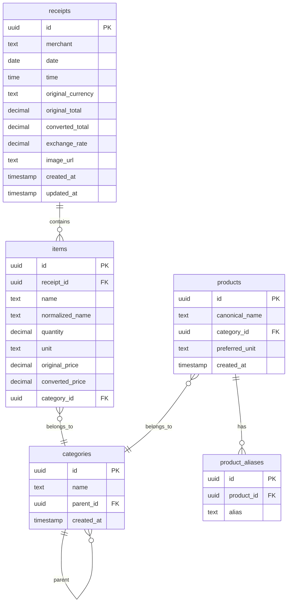

# 02 – Data Models & Database Schema

## Overview

This document defines the complete database schema for the Receipt Intelligence App. All tables use UUID primary keys, and timestamps are stored as UTC. The schema is designed for PostgreSQL but can be adapted to any SQL database.

## Entity‑Relationship Diagram



---

## Table Definitions

### `receipts`

| Column | Type | Constraints | Description |
|--------|------|-------------|-------------|
| `id` | UUID | PRIMARY KEY | Unique identifier |
| `merchant` | TEXT | NOT NULL | Store name where purchase was made |
| `date` | DATE | NOT NULL | Purchase date (YYYY-MM-DD) |
| `time` | TIME | | Optional purchase time (HH:MM:SS) |
| `original_currency` | CHAR(3) | NOT NULL | ISO 4217 currency code (e.g., 'EUR', 'USD') |
| `original_total` | DECIMAL(10,2) | NOT NULL | Total amount in original currency |
| `converted_total` | DECIMAL(10,2) | NOT NULL | Total amount converted to user's primary currency |
| `exchange_rate` | DECIMAL(10,6) | NOT NULL | Exchange rate used for conversion |
| `image_url` | TEXT | | Remote URL to receipt image/PDF file |
| `created_at` | TIMESTAMPTZ | NOT NULL, DEFAULT NOW() | Record creation timestamp |
| `updated_at` | TIMESTAMPTZ | NOT NULL, DEFAULT NOW() | Record last update timestamp |

**Notes:**
- `converted_total` = `original_total` × `exchange_rate`
- Timestamps use timezone-aware type for consistency

---

### `items`

| Column | Type | Constraints | Description |
|--------|------|-------------|-------------|
| `id` | UUID | PRIMARY KEY | Unique identifier |
| `receipt_id` | UUID | NOT NULL, FOREIGN KEY REFERENCES `receipts(id)` ON DELETE CASCADE | Parent receipt |
| `name` | TEXT | NOT NULL | Original item name as entered by user |
| `normalized_name` | TEXT | NOT NULL | Canonical product name (from `products` table) |
| `quantity` | DECIMAL(10,2) | NOT NULL, DEFAULT 1 | Quantity purchased |
| `unit` | TEXT | | Unit of measurement (e.g., 'kg', 'l', 'pcs') |
| `original_price` | DECIMAL(10,2) | NOT NULL | Price in receipt's original currency |
| `converted_price` | DECIMAL(10,2) | NOT NULL | Price converted to primary currency |
| `category_id` | UUID | FOREIGN KEY REFERENCES `categories(id)` ON DELETE SET NULL | Denormalized category for fast analytics |

**Notes:**
- `converted_price` = `original_price` × `exchange_rate` (from parent receipt)
- `category_id` is denormalized from the product's category for query performance

---

### `products`

| Column | Type | Constraints | Description |
|--------|------|-------------|-------------|
| `id` | UUID | PRIMARY KEY | Unique identifier |
| `canonical_name` | TEXT | UNIQUE NOT NULL | Standardized product name (e.g., 'milk', 'whole-wheat-bread') |
| `category_id` | UUID | FOREIGN KEY REFERENCES `categories(id)` ON DELETE SET NULL | Default category for this product |
| `preferred_unit` | TEXT | | Suggested unit for analytics (e.g., 'kg', 'l') |
| `created_at` | TIMESTAMPTZ | NOT NULL, DEFAULT NOW() | When product was first created |

**Notes:**
- `canonical_name` should be lowercase, alphanumeric with hyphens for consistency
- Products are automatically created when a new item name is encountered

---

### `product_aliases`

| Column | Type | Constraints | Description |
|--------|------|-------------|-------------|
| `id` | UUID | PRIMARY KEY | Unique identifier |
| `product_id` | UUID | NOT NULL, FOREIGN KEY REFERENCES `products(id)` ON DELETE CASCADE | Associated product |
| `alias` | TEXT | UNIQUE NOT NULL | Alternative name mapping (e.g., 'mléko', 'milch') |

**Notes:**
- Store aliases in lowercase for case‑insensitive matching
- Multiple aliases can map to the same product

---

### `categories`

| Column | Type | Constraints | Description |
|--------|------|-------------|-------------|
| `id` | UUID | PRIMARY KEY | Unique identifier |
| `name` | TEXT | NOT NULL | Category display name (e.g., 'Dairy', 'Bakery') |
| `parent_id` | UUID | FOREIGN KEY REFERENCES `categories(id)` ON DELETE CASCADE | Parent category for hierarchical structure (NULL for root) |
| `created_at` | TIMESTAMPTZ | NOT NULL, DEFAULT NOW() | When category was created |

**Notes:**
- Supports infinite nesting depth
- Root categories have `parent_id = NULL`
- On delete, child categories cascade delete (or could be set to NULL depending on requirements)

---

### `user_settings`

A simple key‑value store for user preferences.

| Column | Type | Constraints | Description |
|--------|------|-------------|-------------|
| `key` | TEXT | PRIMARY KEY | Setting identifier |
| `value` | JSONB | NOT NULL | JSON‑encoded setting value |
| `updated_at` | TIMESTAMPTZ | NOT NULL, DEFAULT NOW() | Last update timestamp |

**Default Settings:**
```json
{
  "primary_currency": "PLN",
  "default_view": "list",
  "date_format": "DD/MM/YYYY",
  "theme": "dark",
  "language": "en"
}
```

---

## Complete SQL Schema

```sql
-- Enable UUID extension
CREATE EXTENSION IF NOT EXISTS "uuid-ossp";

-- Categories table (supports hierarchy)
CREATE TABLE categories (
    id UUID PRIMARY KEY DEFAULT uuid_generate_v4(),
    name TEXT NOT NULL,
    parent_id UUID REFERENCES categories(id) ON DELETE CASCADE,
    created_at TIMESTAMPTZ NOT NULL DEFAULT NOW()
);

-- Products table (normalized product names)
CREATE TABLE products (
    id UUID PRIMARY KEY DEFAULT uuid_generate_v4(),
    canonical_name TEXT UNIQUE NOT NULL,
    category_id UUID REFERENCES categories(id) ON DELETE SET NULL,
    preferred_unit TEXT,
    created_at TIMESTAMPTZ NOT NULL DEFAULT NOW()
);

-- Product aliases (for name normalization)
CREATE TABLE product_aliases (
    id UUID PRIMARY KEY DEFAULT uuid_generate_v4(),
    product_id UUID NOT NULL REFERENCES products(id) ON DELETE CASCADE,
    alias TEXT UNIQUE NOT NULL,
    created_at TIMESTAMPTZ NOT NULL DEFAULT NOW()
);

-- Receipts table
CREATE TABLE receipts (
    id UUID PRIMARY KEY DEFAULT uuid_generate_v4(),
    merchant TEXT NOT NULL,
    date DATE NOT NULL,
    time TIME,
    original_currency CHAR(3) NOT NULL,
    original_total DECIMAL(10,2) NOT NULL,
    converted_total DECIMAL(10,2) NOT NULL,
    exchange_rate DECIMAL(10,6) NOT NULL,
    image_url TEXT,
    created_at TIMESTAMPTZ NOT NULL DEFAULT NOW(),
    updated_at TIMESTAMPTZ NOT NULL DEFAULT NOW()
);

-- Items table
CREATE TABLE items (
    id UUID PRIMARY KEY DEFAULT uuid_generate_v4(),
    receipt_id UUID NOT NULL REFERENCES receipts(id) ON DELETE CASCADE,
    name TEXT NOT NULL,
    normalized_name TEXT NOT NULL,
    quantity DECIMAL(10,2) NOT NULL DEFAULT 1,
    unit TEXT,
    original_price DECIMAL(10,2) NOT NULL,
    converted_price DECIMAL(10,2) NOT NULL,
    category_id UUID REFERENCES categories(id) ON DELETE SET NULL,
    created_at TIMESTAMPTZ NOT NULL DEFAULT NOW()
);

-- User settings table
CREATE TABLE user_settings (
    key TEXT PRIMARY KEY,
    value JSONB NOT NULL,
    updated_at TIMESTAMPTZ NOT NULL DEFAULT NOW()
);

-- Insert default user settings
INSERT INTO user_settings (key, value) VALUES 
    ('primary_currency', '"PLN"'),
    ('default_view', '"list"'),
    ('date_format', '"DD/MM/YYYY"'),
    ('theme', '"dark"'),
    ('language', '"en"')
ON CONFLICT (key) DO NOTHING;
```

---

## Indexes

For optimal query performance, create the following indexes:

```sql
-- Receipts indexes
CREATE INDEX idx_receipts_date ON receipts(date);
CREATE INDEX idx_receipts_merchant ON receipts(merchant) WHERE merchant IS NOT NULL;
CREATE INDEX idx_receipts_created_at ON receipts(created_at);

-- Items indexes
CREATE INDEX idx_items_receipt_id ON items(receipt_id);
CREATE INDEX idx_items_normalized_name ON items(normalized_name);
CREATE INDEX idx_items_category_id ON items(category_id);
CREATE INDEX idx_items_receipt_category ON items(receipt_id, category_id);

-- Products indexes
CREATE INDEX idx_products_canonical_name ON products(canonical_name);
CREATE INDEX idx_products_category_id ON products(category_id);

-- Product aliases indexes
CREATE INDEX idx_product_aliases_alias ON product_aliases(alias);
CREATE INDEX idx_product_aliases_product_id ON product_aliases(product_id);

-- Categories indexes
CREATE INDEX idx_categories_parent_id ON categories(parent_id);
CREATE INDEX idx_categories_name ON categories(name);

-- Full-text search indexes (PostgreSQL specific)
CREATE INDEX idx_receipts_merchant_trgm ON receipts USING gin (merchant gin_trgm_ops);
CREATE INDEX idx_items_name_trgm ON items USING gin (name gin_trgm_ops);
```

---

## Views (Optional)

### Receipt Summary View

```sql
CREATE VIEW receipt_summary AS
SELECT 
    r.id,
    r.merchant,
    r.date,
    r.original_currency,
    r.original_total,
    r.converted_total,
    COUNT(i.id) as item_count,
    r.image_url,
    r.created_at
FROM receipts r
LEFT JOIN items i ON i.receipt_id = r.id
GROUP BY r.id;
```

### Category Spending View

```sql
CREATE VIEW category_spending AS
SELECT 
    c.id as category_id,
    c.name as category_name,
    c.parent_id,
    SUM(i.converted_price) as total_spent,
    COUNT(DISTINCT i.receipt_id) as receipt_count,
    COUNT(i.id) as item_count
FROM categories c
LEFT JOIN items i ON i.category_id = c.id
LEFT JOIN receipts r ON r.id = i.receipt_id
GROUP BY c.id, c.name, c.parent_id;
```

---

## Data Integrity Rules

### 1. Referential Integrity

- **Receipts → Items**: Cascade delete – when a receipt is deleted, all its items are automatically deleted.
- **Products → Aliases**: Cascade delete – when a product is deleted, all its aliases are removed.
- **Categories → Items**: Set NULL – when a category is deleted, items keep their data but lose category association.
- **Categories → Products**: Set NULL – when a category is deleted, products are uncategorized.

### 2. Total Consistency

The receipt's `original_total` must equal the sum of `original_price` × `quantity` for all items.

**Validation trigger:**
```sql
CREATE OR REPLACE FUNCTION validate_receipt_total()
RETURNS TRIGGER AS $$
BEGIN
    IF NEW.original_total != (
        SELECT SUM(original_price * quantity)
        FROM items
        WHERE receipt_id = NEW.id
    ) THEN
        RAISE EXCEPTION 'Receipt total does not match sum of items';
    END IF;
    RETURN NEW;
END;
$$ LANGUAGE plpgsql;

CREATE TRIGGER validate_receipt_total_trigger
    AFTER INSERT OR UPDATE ON receipts
    FOR EACH ROW
    EXECUTE FUNCTION validate_receipt_total();
```

### 3. Currency Validation

- `original_currency` must be a valid ISO 4217 currency code (3 letters)
- `exchange_rate` must be > 0
- `converted_total` = `original_total` × `exchange_rate`

### 4. Item Validation

- `quantity` > 0
- `original_price` > 0
- `name` cannot be empty or whitespace only

---

## Migration Strategy

### Using Knex.js

```javascript
// migrations/20250323120000_initial_schema.js
exports.up = async function(knex) {
    // Enable UUID extension
    await knex.raw('CREATE EXTENSION IF NOT EXISTS "uuid-ossp"');
    
    // Categories
    await knex.schema.createTable('categories', table => {
        table.uuid('id').primary().defaultTo(knex.raw('uuid_generate_v4()'));
        table.string('name').notNullable();
        table.uuid('parent_id').references('id').inTable('categories').onDelete('CASCADE');
        table.timestamp('created_at').notNullable().defaultTo(knex.fn.now());
    });
    
    // Products
    await knex.schema.createTable('products', table => {
        table.uuid('id').primary().defaultTo(knex.raw('uuid_generate_v4()'));
        table.string('canonical_name').unique().notNullable();
        table.uuid('category_id').references('id').inTable('categories').onDelete('SET NULL');
        table.string('preferred_unit');
        table.timestamp('created_at').notNullable().defaultTo(knex.fn.now());
    });
    
    // Product aliases
    await knex.schema.createTable('product_aliases', table => {
        table.uuid('id').primary().defaultTo(knex.raw('uuid_generate_v4()'));
        table.uuid('product_id').notNullable().references('id').inTable('products').onDelete('CASCADE');
        table.string('alias').unique().notNullable();
        table.timestamp('created_at').notNullable().defaultTo(knex.fn.now());
    });
    
    // Receipts
    await knex.schema.createTable('receipts', table => {
        table.uuid('id').primary().defaultTo(knex.raw('uuid_generate_v4()'));
        table.string('merchant').notNullable();
        table.date('date').notNullable();
        table.time('time');
        table.string('original_currency', 3).notNullable();
        table.decimal('original_total', 10, 2).notNullable();
        table.decimal('converted_total', 10, 2).notNullable();
        table.decimal('exchange_rate', 10, 6).notNullable();
        table.string('image_url');
        table.timestamps(true, true);
    });
    
    // Items
    await knex.schema.createTable('items', table => {
        table.uuid('id').primary().defaultTo(knex.raw('uuid_generate_v4()'));
        table.uuid('receipt_id').notNullable().references('id').inTable('receipts').onDelete('CASCADE');
        table.string('name').notNullable();
        table.string('normalized_name').notNullable();
        table.decimal('quantity', 10, 2).notNullable().defaultTo(1);
        table.string('unit');
        table.decimal('original_price', 10, 2).notNullable();
        table.decimal('converted_price', 10, 2).notNullable();
        table.uuid('category_id').references('id').inTable('categories').onDelete('SET NULL');
        table.timestamp('created_at').notNullable().defaultTo(knex.fn.now());
    });
    
    // User settings
    await knex.schema.createTable('user_settings', table => {
        table.string('key').primary();
        table.jsonb('value').notNullable();
        table.timestamp('updated_at').notNullable().defaultTo(knex.fn.now());
    });
    
    // Insert default settings
    await knex('user_settings').insert([
        { key: 'primary_currency', value: '"PLN"' },
        { key: 'default_view', value: '"list"' },
        { key: 'date_format', value: '"DD/MM/YYYY"' },
        { key: 'theme', value: '"dark"' },
        { key: 'language', value: '"en"' }
    ]);
    
    // Create indexes
    await knex.raw('CREATE INDEX idx_receipts_date ON receipts(date)');
    await knex.raw('CREATE INDEX idx_receipts_merchant ON receipts(merchant) WHERE merchant IS NOT NULL');
    await knex.raw('CREATE INDEX idx_items_receipt_id ON items(receipt_id)');
    await knex.raw('CREATE INDEX idx_items_normalized_name ON items(normalized_name)');
    await knex.raw('CREATE INDEX idx_product_aliases_alias ON product_aliases(alias)');
    await knex.raw('CREATE INDEX idx_categories_parent_id ON categories(parent_id)');
};

exports.down = async function(knex) {
    await knex.schema.dropTableIfExists('items');
    await knex.schema.dropTableIfExists('receipts');
    await knex.schema.dropTableIfExists('product_aliases');
    await knex.schema.dropTableIfExists('products');
    await knex.schema.dropTableIfExists('categories');
    await knex.schema.dropTableIfExists('user_settings');
};
```

---

## Seed Data (Initial Categories)

```sql
-- Insert root categories
INSERT INTO categories (name) VALUES 
    ('Groceries'),
    ('Dining Out'),
    ('Transportation'),
    ('Utilities'),
    ('Entertainment'),
    ('Healthcare'),
    ('Shopping'),
    ('Education'),
    ('Other');

-- Insert subcategories for Groceries
INSERT INTO categories (name, parent_id) VALUES 
    ('Dairy', (SELECT id FROM categories WHERE name = 'Groceries')),
    ('Bakery', (SELECT id FROM categories WHERE name = 'Groceries')),
    ('Meat', (SELECT id FROM categories WHERE name = 'Groceries')),
    ('Produce', (SELECT id FROM categories WHERE name = 'Groceries')),
    ('Beverages', (SELECT id FROM categories WHERE name = 'Groceries')),
    ('Snacks', (SELECT id FROM categories WHERE name = 'Groceries'));

-- Insert common products
INSERT INTO products (canonical_name, category_id, preferred_unit) VALUES 
    ('milk', (SELECT id FROM categories WHERE name = 'Dairy'), 'l'),
    ('bread', (SELECT id FROM categories WHERE name = 'Bakery'), 'pcs'),
    ('eggs', (SELECT id FROM categories WHERE name = 'Dairy'), 'pcs'),
    ('cheese', (SELECT id FROM categories WHERE name = 'Dairy'), 'kg'),
    ('chicken', (SELECT id FROM categories WHERE name = 'Meat'), 'kg'),
    ('apples', (SELECT id FROM categories WHERE name = 'Produce'), 'kg');

-- Insert aliases
INSERT INTO product_aliases (product_id, alias) VALUES 
    ((SELECT id FROM products WHERE canonical_name = 'milk'), 'mléko'),
    ((SELECT id FROM products WHERE canonical_name = 'milk'), 'milch'),
    ((SELECT id FROM products WHERE canonical_name = 'bread'), 'chleb'),
    ((SELECT id FROM products WHERE canonical_name = 'bread'), 'brot');
```

---

## Performance Considerations

### Query Optimization Tips

1. **Use indexed columns** in WHERE clauses
2. **Avoid SELECT *** – specify only needed columns
3. **Use LIMIT** for paginated queries
4. **Consider materialized views** for heavy analytics queries
5. **Archive old data** for performance with very large datasets

### Recommended Query Patterns

```sql
-- Efficient pagination
SELECT * FROM receipts 
WHERE date >= '2025-01-01' 
ORDER BY date DESC 
LIMIT 20 OFFSET 0;

-- Category tree query
WITH RECURSIVE category_tree AS (
    SELECT id, name, parent_id FROM categories WHERE id = '...'
    UNION ALL
    SELECT c.id, c.name, c.parent_id 
    FROM categories c
    INNER JOIN category_tree ct ON c.parent_id = ct.id
)
SELECT * FROM category_tree;

-- Product search with aliases
SELECT p.* FROM products p
WHERE p.canonical_name ILIKE '%milk%'
UNION
SELECT p.* FROM products p
JOIN product_aliases pa ON pa.product_id = p.id
WHERE pa.alias ILIKE '%milk%';
```

---

## Data Retention Policy (Future)

For V2+, consider implementing:
- Automatic archiving of receipts older than X years
- Soft delete with `deleted_at` column
- Scheduled cleanup jobs

```sql
ALTER TABLE receipts ADD COLUMN deleted_at TIMESTAMPTZ;
CREATE INDEX idx_receipts_deleted_at ON receipts(deleted_at);
```

---

## Summary

This schema provides:
- **Normalized structure** with relationships
- **Hierarchical categories** for flexible organization
- **Product normalization** for consistent analytics
- **Currency conversion** with rate tracking
- **Performance indexes** for common queries
- **Data integrity constraints** for consistency
- **Extensibility** for future features
